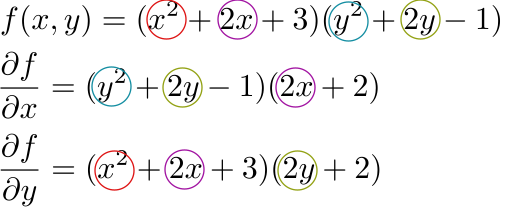
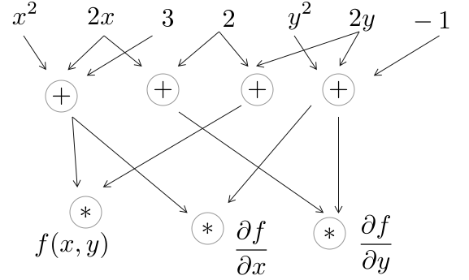

layout: true

---

    <h1>
    Vector, covector, the exterior derivative and Hashed Expression
    </h1>
    

    
 
        <ul class="table-content">
            <li>Motivation</li>
            <li>Vector & covector</li>
            <li>The exterior derivative</li>
            <li>Hashed Expression</li>
        </ul>
    

---

    <h1>
    Vector, covector, the exterior derivative and Hashed Expression
    </h1>
    

    
 
        <ul class="table-content">
            <li class="table-content-selected">Motivation</li>
            <li>Vector & covector</li>
            <li>The exterior derivative</li>
            <li>Hashed Expression</li>
        </ul>
    

---

# Motivation

- Optimization problems
--

- The objective function 
--

    

--

- The gradient 
--

    

--

    

--

    

---

# Motivation
- Many sharing expressions

	

--

---

# Motivation
- Speedup opportunity
    - Recognize common expressions
    - Schedule evaluation
    
--

	

# Goals
- 
