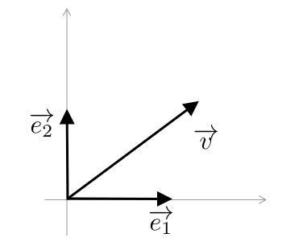
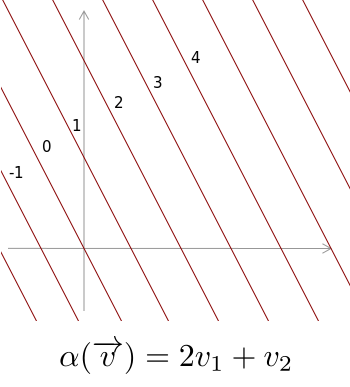
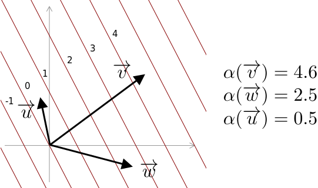
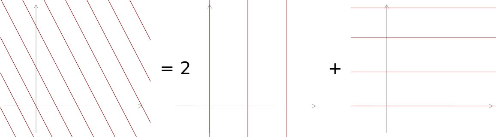

layout: true

---

    <h1>
    Vector, covector, the exterior derivative and Hashed Expression
    </h1>
    

    
 
        <ul class="table-content">
            <li>Motivation</li>
            <li>Vector & covector</li>
            <li>The exterior derivative</li>
            <li>Hashed Expression</li>
        </ul>
    

---

    <h1>
    Vector, covector, the exterior derivative and Hashed Expression
    </h1>
    

    
 
        <ul class="table-content">
            <li class="table-content-selected">Motivation</li>
            <li>Vector & covector</li>
            <li>The exterior derivative</li>
            <li>Hashed Expression</li>
        </ul>
    

---

# Motivation

- Optimization problems
--

- The objective function 
--

    

--

- The gradient 
--

    

--

    

--

    

---

# Motivation
- Many sharing expressions

	

--

---

# Motivation
- Speedup opportunity
    - Recognize common expressions
    - Schedule evaluation
    
--

	

---

# Goals
- Encode expressions
    - Directed acyclic graph (DAG)
- Identify common sub-expressions
    - Hash
- Compute the derivatives (symbolically)

---

# Computing derivatives

- Gradient

    

    - Components separate
    - How to reason with multidimensional variables?

---

# Computing derivatives

- Implicit derivative

	

    - Infinitesimal change
    - Directional derivatives?

- Differential form (1-form)

	

	

---

    <h1>
    Vector, covector, the exterior derivative and Hashed Expression
    </h1>
    

    
 
        <ul class="table-content">
            <li>Motivation</li>
            <li class="table-content-selected">Vector & covector</li>
            <li>The exterior derivative</li>
            <li>Hashed Expression</li>
        </ul>
    

---

# Vector

- Element of a vector space

    

- Basis

    

- Vector components

    

    

---

# Vector
- Vector components

    

--

	

---

# Covector
- Linear functional on vectors

    

    

- Examples

    

---

# Covector
- Function
- Levels set

	

---

# Covector 

- Apply to a vector

	

- The changing of value following the vector

---

# Covector
- The dual space

    

- Basis
    

        
    

    

        
    

- Covector components
    

        
    

---

# Covector 
- Covector components

    

	

- As row

	

---

    <h1>
    Vector, covector, the exterior derivative and Hashed Expression
    </h1>
    

    
 
        <ul class="table-content">
            <li>Motivation</li>
            <li>Vector & covector</li>
            <li class="table-content-selected">The exterior derivative</li>
            <li>Hashed Expression</li>
        </ul>
    

    

