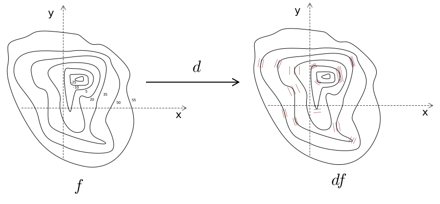

layout: true


---

<div style="margin-top: 130px">
    <h1>
    Vector, covector, the exterior derivative and Hashed Expression
    </h1>
    <div class="horizontal-line"></div>
    <div class="flex-row" style="justify-content: flex-end; margin-right: 30px"> 
        <ul class="table-content">
            <li>Motivation</li>
            <li>Vector & covector</li>
            <li>The exterior derivative</li>
            <li>Hashed Expression</li>
        </ul>
    </div>
</div>

---

<div style="margin-top: 130px">
    <h1>
    Vector, covector, the exterior derivative and Hashed Expression
    </h1>
    <div class="horizontal-line"></div>
    <div class="flex-row" style="justify-content: flex-end; margin-right: 30px"> 
        <ul class="table-content">
            <li class="table-content-selected">Motivation</li>
            <li>Vector & covector</li>
            <li>The exterior derivative</li>
            <li>Hashed Expression</li>
        </ul>
    </div>
</div>

---

# Motivation

- Optimization problems
--

- The objective function 
--

<div>
    
</div>
--

- The gradient 
--

<div>
    
</div>

--
<div>
    
</div>

--
<div>
    
</div>

---

# Motivation
- Many sharing expressions
<div>
	
</div>
--

---

# Motivation
- Speedup opportunity
    - Recognize common expressions
    - Schedule evaluation
    
--

<div class="flex-row" style="justify-content: center">
	
</div>

---

# Goals
- Encode expressions
    - Directed acyclic graph (DAG)
- Identify common sub-expressions
    - Hash
- Compute the derivatives (symbolically)

---

# Computing derivatives

- Gradient
<div>
    
</div>
    - Components separate
    - How to reason with multidimensional variables?

---

# Computing derivatives

- Implicit derivative
<div>
	
</div>
    - Infinitesimal change
    - Directional derivatives?


- Differential form (1-form)
<div>
	
</div>
<div>
	
</div>


---

<div style="margin-top: 130px">
    <h1>
    Vector, covector, the exterior derivative and Hashed Expression
    </h1>
    <div class="horizontal-line"></div>
    <div class="flex-row" style="justify-content: flex-end; margin-right: 30px"> 
        <ul class="table-content">
            <li>Motivation</li>
            <li class="table-content-selected">Vector & covector</li>
            <li>The exterior derivative</li>
            <li>Hashed Expression</li>
        </ul>
    </div>
</div>

---

# Vector

- Element of a vector space
<div>
    
</div>

- Basis
<div>
    
</div>

- Vector components
<div>
    
</div>
    

---

# Vector
- Vector components
<div>
    
</div>


--
<div class="flex-row" style="justify-content: center">
	
</div>

---

# Covector
- Linear functional on vectors
<div>
    
</div>
<div>
    
</div>
- Examples
<div>
    
</div>

---

# Covector
- Function
- Levels set
<div class="flex-row" style="justify-content: center;">
	
</div>


---

# Covector 

- Apply to a vector
<div class="flex-row" style="justify-content: center;">
	
</div>
- The changing of value following the vector


---

# Covector
- The dual space
<div>
    
</div>
- Basis
    <div>
        
    </div>
    <div>
        
    </div>
- Covector components
    <div>
        
    </div>

---

# Covector 
- Covector components
<div>
    
</div>
<div>
	
</div>
- As row
<div>
	
</div>

---

<div style="margin-top: 130px">
    <h1>
    Vector, covector, the exterior derivative and Hashed Expression
    </h1>
    <div class="horizontal-line"></div>
    <div class="flex-row" style="justify-content: flex-end; margin-right: 30px"> 
        <ul class="table-content">
            <li>Motivation</li>
            <li>Vector & covector</li>
            <li class="table-content-selected">The exterior derivative</li>
            <li>Hashed Expression</li>
        </ul>
    </div>
</div>
    
---

# Exterior derivative
- Tangent space 
    - Every point in manifold `M` (care  only)
    - Set of all tangent vectors to the point p
    - Form a vector space with 
    - 
    - 

---
# Exterior derivative
- Tangent space
<div class="flex-row" style="justify-content: center;">
	
</div>

---
# Exterior derivative
- Tangent space
<div class="flex-row" style="justify-content: center;">
	
</div>
    
---
# Exterior derivative
- Exterior derivative
    - Turn *k*-form to *(k+1)*-form
    - *k*-form
    <div>
    
    </div>
    <div>
    
    </div>
    
        

---
# 1-form
- First exterior derivative (*0*-form to *1*-form)
<div>


</div>
      
---
# 1-form
<div class="flex-row" style="justify-content: center; height: 80%">
	
</div>

---
# 1-form
<div class="flex-row" style="justify-content: center; height: 80%">
	
</div>

---
# 1-form
<div class="flex-row" style="justify-content: center; height: 80%">
	
</div>

---
# 1-form
<div class="flex-row" style="justify-content: center; height: 80%">
	
</div>

---
# 1-form
- Basis
<div class="flex-row" style="justify-content: center; height: 80%">
	
</div>


---
# 1-form
- Basis
<div>
	
</div>
- Component
<div>
    
</div>
- Similarly
<div>
    
</div>
<div>
    
</div>


---

<div style="margin-top: 130px">
    <h1>
    Vector, covector, the exterior derivative and Hashed Expression
    </h1>
    <div class="horizontal-line"></div>
    <div class="flex-row" style="justify-content: flex-end; margin-right: 30px"> 
        <ul class="table-content">
            <li>Motivation</li>
            <li>Vector & covector</li>
            <li >The exterior derivative</li>
            <li class="table-content-selected">Hashed Expression</li>
        </ul>
    </div>
</div>

---
# Hashed Expression
- Share common subexpressions
- Type-safety 
- Compute derivatives symbolically
- Simplify and group expressions
- Part of the **Coconut** ecosystem

---
# Types

```haskell
data Expression d et =
    Expression
        { exIndex :: Int 
        , exMap :: ExpressionMap 
        }
    deriving (Show, Eq, Ord, Typeable)

-- d: Zero, One, Two, Three
-- et: R, C, Covector 
```

---
# Types

```haskell
type Internal = (Shape, Node)
-- []        --> scalar
-- [n]       --> 1D with size n
-- [n, m]    --> 2D with size n × m
-- [n, m, p] --> 3D with size n × m × p
type Shape = [Int]

type ExpressionMap = IntMap Internal
```
---
# Types

```haskell
data Node
    = Var String
    | DVar String 
    | Const Double 
    | Sum ET Args 
    | Mul ET Args 
    | Scale ET Arg Arg
    | Div Arg Arg
    ...
```

---
# Share common subexpressions
```haskell
$ x = var "x"
Expression 
    { exIndex = 120
    , exMap = 
        fromList [(120,([],Var "x"))]
    }
```

---
# Share common subexpressions
```haskell
$ x + x
Expression 
    { exIndex = 254577784
    , exMap = fromList 
        [ (120,([],Var "x")),
        , (254577784,([],Sum R [120,120]))
        ]
    }
```

---
# Share common subexpressions
```haskell
$ (x + y) + (x + y)
Expression
    { exIndex = 542494359821144
    , exMap =
          fromList
              [ (120, ([], Var "x"))
              , (121, ([], Var "y"))
              , (256625675, ([], Sum R [120, 121]))
              , (542494359821144, 
                ([], Sum R [256625675, 256625675]))
              ]
    }
```

---
# Type safety
- 2 phantom type argument in `Expression`
    ```haskell
    data Expression d et =
        Expression
            { exIndex :: Int 
            , exMap :: ExpressionMap 
            }
    ```


---

# Type safety
```haskell
-- | Type representation of 
-- elements in the 0D, 1D, 2D, 3D, ... grid
--
data R
    deriving (NumType, ElementType, Addable)

data C
    deriving (NumType, ElementType, Addable)

data Covector
    deriving (ElementType, Addable)
```

---

# Type safety

```haskell
-- | Type representation of dimension
--
data Zero
    deriving (DimensionType)

data One
    deriving (DimensionType)

data Two
    deriving (DimensionType)

data Three
    deriving (DimensionType)
```


---

# Type safety
- We can then govern which operations are allowed on which kind of expressions, and the returned kind of expression
    ```haskell
    (+) :: (Addable et, DimensionType d) 
        => Expression d et 
        -> Expression d et 
        -> Expression d et
    ```
    
---
    
# Type safety
- The exterior derivative
    ```haskell
    exteriorDerivative ::
           (DimensionType d)
        => Set String
        -> Expression d R
        -> Expression d Covector
    ```

---
# Demo
